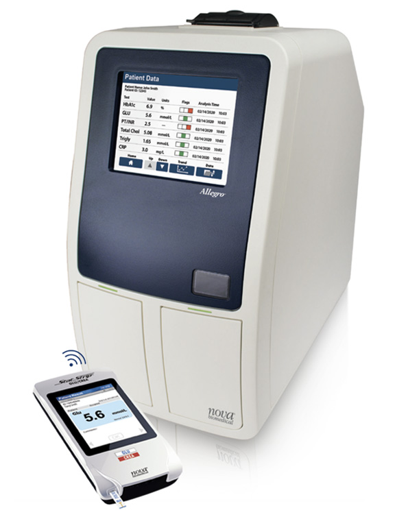

# Blood Analyzer – MDR Example

This document explains how to apply the European Medical Device Regulation (MDR 2017/745) to a **blood analyzer**. It is intended for biomedical engineers and regulatory learners.

---

##  1. Device Description

A **blood analyzer** is an automated system that analyzes blood samples to determine physiological and chemical properties.

Common types:
- Hematology analyzers (e.g. CBC)
- Biochemistry analyzers (e.g. liver enzymes, glucose)
- Immunoassay analyzers (e.g. hormones, antigens)
- Gas analyzers (e.g. pH, pCO₂)

---

##  2. MDR Classification

Blood analyzers may fall under **MDR** or **IVDR** depending on purpose:

| Purpose | Classification |
|---------|----------------|
| General blood testing with clinical impact | **Class IIa (MDR)** |
| For diagnostic decision-making (e.g., sepsis) | **Class IIb (MDR)** |
| If only testing samples outside body (no therapeutic use) | **Covered by IVDR** |

> ❗ **If the device has direct clinical application or therapeutic decision impact**, it's regulated under **MDR** as Class IIa or IIb.  
> Otherwise, for pure lab diagnostics with no direct effect on therapy, **IVDR** applies.

(For this example, we'll assume a **Class IIa MDR** blood chemistry analyzer.)

---

##  3. Technical Documentation (Annex II)

Must include:

- General design and system architecture
- Sample handling mechanism and throughput
- Measurement principles (optical, electrical, spectrophotometry)
- Types of reagents used
- Cartridge/tube compatibility
- Software logic and data analysis
- Calibration, quality control procedures
- Risk analysis (ISO 14971)
- Electrical safety (IEC 61010 or IEC 60601-1)
- EMC compliance (IEC 60601-1-2)

---

##  4. Clinical Evaluation (Annex XIV)

You must:

- Validate measurement accuracy vs reference lab methods
- Demonstrate repeatability and linearity
- Show clinical relevance of measured parameters
- Evaluate usability in clinical/lab workflow

---

##  5. Labeling & IFU (Annex I)

Include:

- CE mark and UDI
- Sample types accepted (whole blood, serum, plasma)
- Storage and operating conditions
- Instructions for calibration and QC
- Waste handling and biohazard warnings
- Interface and software explanation
- Maintenance instructions

---

##  6. CE Marking

- For **Class IIa MDR**:  
  ➤ Requires **Notified Body** assessment  
  ➤ Conformity via Annex IX or XI  
  ➤ QMS certification (ISO 13485)  
  ➤ Declaration of Conformity after approval

---

##  7. Post-Market Surveillance

You must:

- Monitor measurement accuracy and errors
- Log field complaints and reagent issues
- Track software bugs affecting test results
- Submit PSUR (Periodic Safety Update Report)
- Feedback from labs, clinicians, and service engineers

---

##  8. Economic Operators

Define roles for:

- Manufacturer
- Authorized Representative (outside EU)
- Importer / Distributor
- Lab service providers (if applicable)

Each must fulfill MDR Articles 11–16.

---

##  9. Relevant Standards

- **ISO 14971** – Risk management  
- **IEC 61010-1** – Electrical safety for lab devices  
- **IEC 60601-1** – If used at point-of-care (hospital)  
- **IEC 60601-1-2** – EMC  
- **ISO 15189** – Clinical lab quality (optional)  
- **ISO 13485** – QMS  
- **IVD-specific standards** – if covered by IVDR

---
### Blood Analyzer – Image 1

---

### Blood Analyzer – Image 2

---

### Blood Analyzer – Image 3

---

### Blood Analyzer – Image 4

##  Summary

| Step                         | Action                                      |
|------------------------------|---------------------------------------------|
| Classification               | Class IIa (MDR) or IVDR                     |
| Technical File               | Sample path, measurement, software, safety  |
| Clinical Evaluation          | Accuracy vs. reference methods              |
| Label & IFU                  | CE, calibration, usage limits, safety info  |
| Conformity
