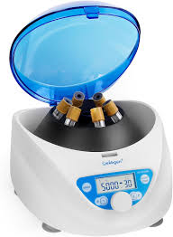

# Centrifuge – MDR Example

This document explains how to apply the European Medical Device Regulation (MDR 2017/745) to a **laboratory centrifuge**. It is designed for biomedical engineers and regulatory learners.

---

##  1. Device Description

A **centrifuge** is a device that spins fluid samples at high speed to separate components based on density. In medical labs, it is used for:

- Blood separation (plasma, serum, cells)
- Urine sediment analysis
- PRP (platelet-rich plasma) preparation

Types:
- Benchtop (non-refrigerated)
- Refrigerated centrifuges
- Swing-out rotor vs. fixed angle

---

##  2. MDR Classification

According to **MDR Annex VIII, Rule 1 & Rule 9**:

| Use case                      | Classification |
|-------------------------------|----------------|
| General diagnostic lab use    | **Class I**     |
| PRP preparation for re-injection | **Class IIa** |

> ❗ If the centrifuge is used **to prepare components for reinjection or transfusion**, it is **Class IIa**  
> Otherwise, for pure diagnostic/lab sample prep, it's **Class I**

---

##  3. Technical Documentation (Annex II)

Must include:

- Design overview and rotor specs
- Max speed (RPM), RCF, acceleration/deceleration profiles
- Lid locking system and imbalance detection
- Materials used (buckets, tube holders)
- Risk analysis (ISO 14971)
- Electrical safety and leakage (IEC 61010 or IEC 60601-1 if clinical)
- EMC testing (IEC 61010-2-20 / IEC 60601-1-2)
- Noise emission level
- Calibration method and frequency

---

##  4. Clinical Evaluation (Annex XIV)

If **Class I** (diagnostic use only):

- No clinical data required — justification sufficient.

If **Class IIa** (e.g. PRP prep, re-injection):

- Show that the process preserves sample integrity  
- Validate platelet concentration and sterility  
- Compare output to predicate devices  

---

##  5. Labeling & IFU (Annex I)

Include:

- CE mark and UDI (even for Class I)
- Maximum rotor capacity and balancing instructions
- Rotor type and tube compatibility
- Locking mechanism warnings
- Cleaning and disinfection procedures
- Maintenance schedule

---

##  6. CE Marking

- **Class I**:  
  ➤ Self-certification, no Notified Body needed  
  ➤ Must still register device and maintain full technical file

- **Class IIa**:  
  ➤ Requires **Notified Body** review  
  ➤ Conformity assessment via Annex IX or XI  
  ➤ ISO 13485 QMS required

---

##  7. Post-Market Surveillance

You must:

- Track mechanical issues (imbalance, lid failure, vibration)
- Maintain maintenance/service logs
- Submit PSUR (if Class IIa)
- Analyze failure reports and user feedback

---

##  8. Economic Operators

Define roles for:

- Manufacturer
- Authorized Representative (if outside EU)
- Importer and Distributor

All must meet MDR obligations (Articles 11–16)

---

##  9. Relevant Standards

- **ISO 14971** – Risk management  
- **IEC 61010-2-020** – Centrifuge-specific electrical safety  
- **IEC 61010-1** – General lab electrical equipment  
- **IEC 60601-1** – If used directly with patients (rare)  
- **ISO 10993** – Biocompatibility (if tubes in contact with re-injected fluids)

---### Centrifuge – Image 1

---

##  Summary

| Step                         | Action                                      |
|------------------------------|---------------------------------------------|
| Classification               | Class I or IIa                              |
| Technical File               | Design, risks, speed, safety features       |
| Clinical Evaluation          | Required only for Class IIa (PRP, reinjection) |
| Label & IFU                  | CE, speed limits, cleaning, warnings        |
| Conformity Assessment        | Self-cert for Class I / NB for Class IIa    |
| Post-Market Surveillance     | Maintenance logs, failures, user reports    |
| Economic Operators           | MDR-defined roles must be documented        |

---

**Note:** This file is an educational guide. MDR submissions must follow full technical and legal validation.
