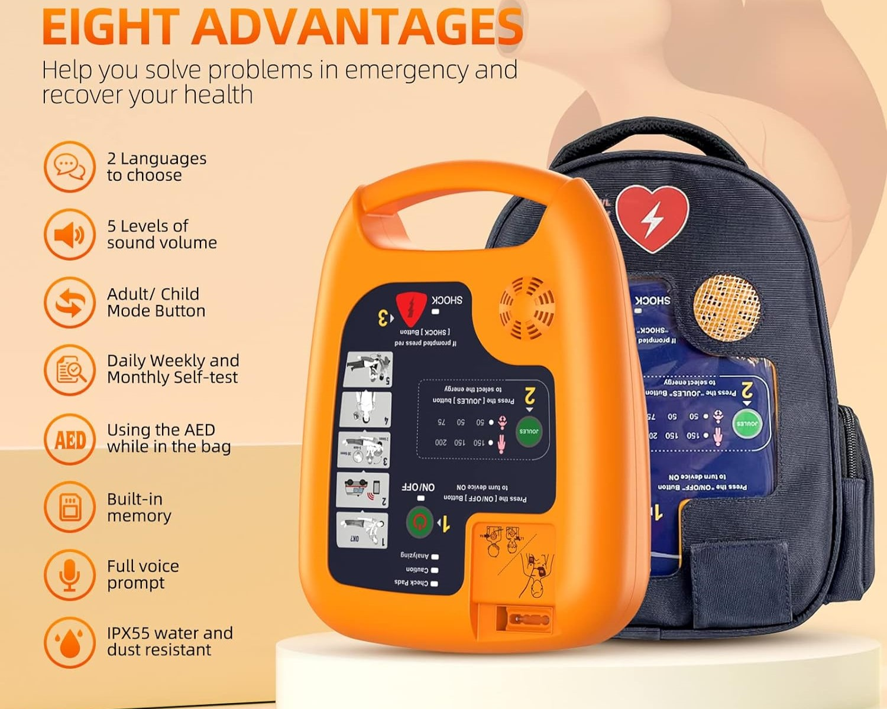
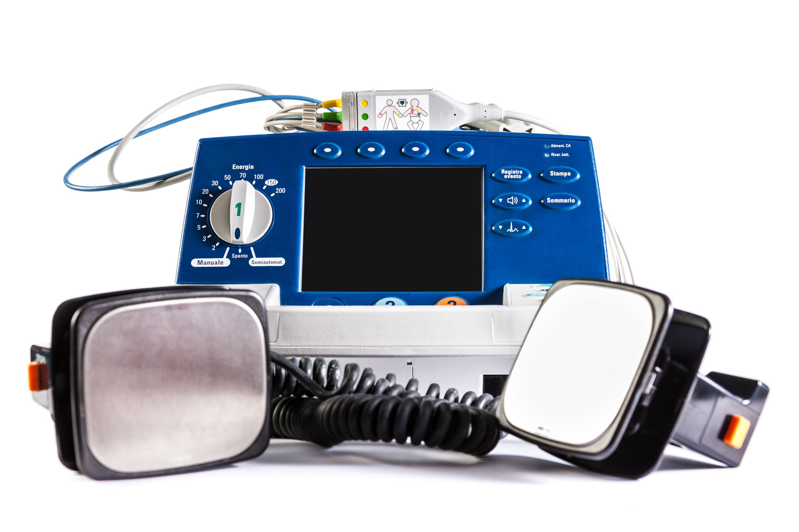

# Defibrillator – MDR Example

This document explains how to apply the European Medical Device Regulation (MDR 2017/745) to a **defibrillator**. It is designed for biomedical engineers and professionals involved in regulatory compliance.

---

##  1. Device Description

A **defibrillator** is a device that delivers a controlled electric shock to the heart in order to restore normal rhythm in cases of cardiac arrhythmias such as ventricular fibrillation or tachycardia.

Types:
- Automated External Defibrillator (AED)
- Manual hospital defibrillators
- Implantable cardioverter-defibrillators (ICD)
- Wearable defibrillators

---

##  2. MDR Classification

Under **MDR Annex VIII, Rule 22 & Rule 9**:

> **“Devices intended to be used to deliver energy to the heart are Class III.”**

Therefore:
- **All defibrillators = Class III**  
  Due to their direct interaction with vital physiological processes and high risk

---

##  3. Technical Documentation (Annex II)

Must include:

- Device architecture and block diagrams
- Energy delivery specs (shock waveform, joules, duration)
- Charging and capacitor safety
- Electrode/pad materials (biocompatibility + adhesive properties)
- Battery life and charging cycles
- Software logic (AED analysis algorithm, shock decision logic)
- Alarm and display systems
- Risk analysis and mitigation (ISO 14971)
- Electrical safety & leakage current (IEC 60601-1)
- EMC testing (IEC 60601-1-2)
- Shock delivery accuracy and test results
- Drop/shock resistance (for AEDs)

---

##  4. Clinical Evaluation (Annex XIV)

You must provide:

- Clinical evidence for shock efficacy
- Time-to-shock vs. success rates
- Comparison with gold-standard defibrillators
- Data on false-positive/false-negative rhythm detection
- Human factors/usability data (especially for AEDs used by laypeople)

---

##  5. Labeling & IFU (Annex I)

Include:

- CE mark and UDI
- Instructions for use (clear, step-by-step)
- Battery life indicators and replacement instructions
- Electrode shelf life and expiry date
- Alarm explanations and visual indicators
- Safety warnings for patient-contact and energy delivery
- Cleaning and disinfection process

---

##  6. CE Marking

Because **Class III**:

- Requires **Notified Body** review + **Design Dossier** (Annex X)
- Full QMS audit (Annex IX)
- Declaration of Conformity after NB approval
- Certified ISO 13485 QMS is mandatory

---

##  7. Post-Market Surveillance

Must include:

- Vigilance system for shock failures or false readings
- Regular submission of **PSUR** (Periodic Safety Update Report)
- Field reports from AED public deployments
- Maintenance logs and battery performance data
- End-user feedback (e.g. rescue effectiveness, usability)

---

##  8. Economic Operators

Define and document:

- Manufacturer
- Authorized Representative (if outside EU)
- Importer and distributor
- Technical and field support provider

Each must fulfill MDR obligations (Articles 11–16)

---

## ⚠️ 9. Relevant Standards

- **IEC 60601-1** – General electrical safety  
- **IEC 60601-2-4** – Particular standard for defibrillators  
- **IEC 60601-1-2** – EMC  
- **ISO 14971** – Risk management  
- **IEC 62304** – Medical software lifecycle  
- **IEC 62366** – Usability  
- **ISO 10993** – Biocompatibility  
- **AHA/ERC clinical performance guidelines**

---
### Defibrillator – Image 1

---

### Defibrillator – Image 2

---

### Defibrillator – Image 3

---

### Defibrillator – Image 4

---

##  Summary

| Step                         | Action                                      |
|------------------------------|---------------------------------------------|
| Classification               | Class III (Rule 22)                         |
| Technical File               | Energy delivery, algorithm, risk file       |
| Clinical Evaluation          | Efficacy data, usability, false detections  |
| Label & IFU                  | CE, battery info, pads, warnings            |
| Conformity Assessment        | NB + Design Dossier + QMS (Annex IX + X)    |
| Post-Market Surveillance     | PSURs, AED field data, failure reports      |
| Economic Operators           | Roles per MDR Articles 11–16               |

---

**Note:** This file is for educational purposes only. Real Class III MDR submissions are subject to strict regulatory oversight.
