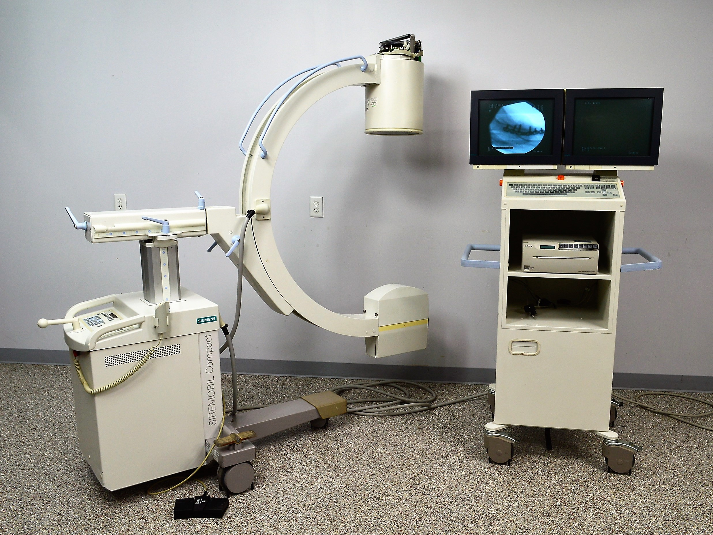

# Fluoroscopy System – MDR Example

This document explains how to apply the European Medical Device Regulation (MDR 2017/745) to a **Fluoroscopy Imaging System**. Intended for biomedical engineers and regulatory professionals.

---

##  1. Device Description

A **Fluoroscopy system** uses continuous X-ray beams to generate **real-time moving images** of internal anatomy, often during surgical or interventional procedures.

Types:
- C-arm systems (mobile or fixed)
- Table-integrated systems
- Hybrid OR systems

Applications:
- Interventional cardiology (catheter placement)
- Orthopedic surgeries
- GI studies (barium swallow, etc.)
- Device implantation and biopsies

---

##  2. MDR Classification

Under **MDR Annex VIII, Rule 10 & Rule 11**:

> **“Devices intended for diagnostic imaging with ionizing radiation are at least Class IIb.”**  
> If used in life-critical guidance (e.g. vascular navigation), could be **Class III**

| Use Case | Classification |
|----------|----------------|
| General fluoroscopy | **Class IIb** |
| Intraoperative critical guidance (neuro, cardiac) | **Class III** |

---

##  3. Technical Documentation (Annex II)

Must include:

- System diagram (X-ray tube, detector, table, display)
- Image acquisition parameters (kV, mA, FPS)
- Dose optimization and safety algorithms
- Mechanical specs (arm movement, brake safety)
- Radiation shielding details
- Cooling system and thermal protection
- Software modules (image processing, dose control)
- Risk analysis (ISO 14971)
- EMC and electrical safety (IEC 60601-1, -1-2)
- Imaging performance validation (IEC 60601-2-43)
- Biocompatibility of patient-contact surfaces (table padding)

---

##  4. Clinical Evaluation (Annex XIV)

You must:

- Validate diagnostic accuracy vs gold standard  
- Show real-time imaging consistency  
- Evaluate radiation exposure control effectiveness  
- Analyze usability in OR and interventional settings  
- Compare to existing systems on market

---

##  5. Labeling & IFU (Annex I)

Include:

- CE mark and UDI
- Exposure mode descriptions and parameters
- Safety warnings: radiation, overuse, movement zones
- Cleaning/disinfection of patient table and controls
- Required training and safety gear
- User instructions for radiation dose monitoring
- Battery backup or emergency mode (if mobile)

---

##  6. CE Marking

- **Class IIb/III = Requires Notified Body**  
- Annex IX (Full QMS audit) + Annex X (for Class III)
- ISO 13485 QMS certification required
- Full Declaration of Conformity referencing MDR

---

##  7. Post-Market Surveillance

Must include:

- Incident reports: image failure, dose overexposure
- PSUR (Periodic Safety Update Report)
- Software error tracking (image freeze, lag)
- Field performance feedback
- Dose monitoring logs and regulatory submissions

---

## 📦 8. Economic Operators

Clearly define:

- Manufacturer  
- Authorized Representative (if outside EU)  
- Importer & Distributor  
- Service/maintenance provider

All must comply with MDR Articles 11–16

---

## ⚠️ 9. Relevant Standards

- **IEC 60601-1** – Electrical safety  
- **IEC 60601-1-2** – EMC  
- **IEC 60601-2-43** – Particular standard for fluoroscopy  
- **ISO 14971** – Risk management  
- **IEC 62304** – Software lifecycle  
- **IEC 62366** – Usability engineering  
- **ISO 10993** – Biocompatibility (contact surfaces)

---
### Fluoroscopy System – Image 1

---

### Fluoroscopy System – Image 2

---

### Fluoroscopy System – Image 3

---

### Fluoroscopy System – Image 4

##  Summary

| Step                         | Action                                      |
|------------------------------|---------------------------------------------|
| Classification               | Class IIb or III                            |
| Technical File               | X-ray safety, software, imaging accuracy    |
| Clinical Evaluation          | Image performance, dose, usability          |
| Label & IFU                  | CE, exposure warnings, cleaning, shielding  |
| Conformity Assessment        | NB + Annex IX (and X for Class III)         |
| Post-Market Surveillance     | PSUR, incident reports, image/dose logs     |
| Economic Operators           | Defined and documented per MDR              |

---

**Note:** Fluoroscopy systems are high-risk imaging devices. MDR submissions require full conformity with clinical, electrical, and radiation safety regulations.
