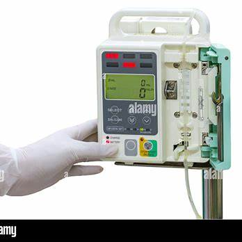
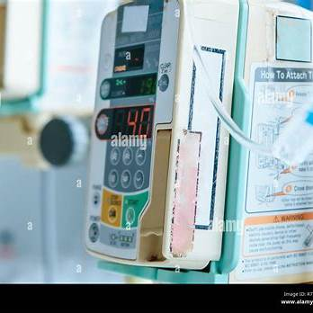
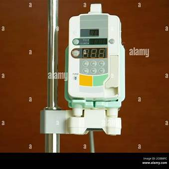
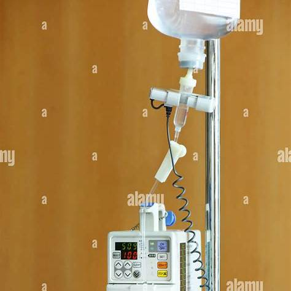

# Infusion Pump – MDR Example

This document explains how to apply the European Medical Device Regulation (MDR 2017/745) to an **infusion pump**. It is written for biomedical engineers and regulatory beginners.

---

##  1. Device Description

An **infusion pump** is a medical device that delivers fluids (medications, nutrients, blood) into a patient's body in controlled amounts. It is widely used in ICUs, ORs, and wards.

Types include:
- Volumetric pumps
- Syringe pumps
- PCA (patient-controlled analgesia) pumps

---

##  2. MDR Classification

Under **MDR Annex VIII, Rule 11** and **Rule 9**:

> **“Active devices intended to administer or remove medicinal products are Class IIb.”**

So:
- All **infusion pumps = Class IIb**
  (because incorrect delivery may result in serious harm or death)

---

##  3. Technical Documentation (Annex II)

The technical file must include:

- General description, photos, diagrams
- Control system logic (flow rate, volume limits)
- Alarms (occlusion, air bubble, end of infusion)
- Flow accuracy validation tests
- Battery backup & failure handling
- Fluid path materials (biocompatibility evidence)
- Cleaning, sterilization, tubing compatibility
- Risk management file (ISO 14971)
- EMC and electrical safety test results (IEC 60601-1)
- Software documentation (IEC 62304 compliance)

---

##  4. Clinical Evaluation (Annex XIV)

Include:

- Clinical studies or literature demonstrating safety and efficacy
- Flow accuracy, reliability, and usability validation
- Equivalence with predicate pumps
- Evaluation of alarm response time and failure recovery

---

##  5. Labeling & IFU (Annex I)

Must include:

- CE mark and UDI
- Operating instructions (in local EU languages)
- Alarm descriptions and responses
- Electrical ratings, battery safety instructions
- Maintenance and calibration schedule
- Sterility and tubing compatibility (if relevant)

---

##  6. CE Marking

- **Conformity assessment** must be conducted via a **Notified Body** (Class IIb requirement)
- Annex IX (Full QMS audit) or Annex XI (Production quality assurance)
- QMS certification (usually ISO 13485)
- Declaration of Conformity issued after assessment

---

##  7. Post-Market Surveillance

You must:
- Monitor device performance and adverse events
- Implement a **PMS plan** and **Vigilance system**
- Submit **PSURs** (Periodic Safety Update Reports)
- Report serious incidents (MDR Article 87)
- Feed real-world data back into the risk file

---

##  8. Economic Operators

Define and document:

- **Manufacturer**
- **Authorized Representative** (if outside EU)
- **Importer**
- **Distributor**

Each must meet their obligations (Articles 11–16)

---

## ⚠ 9. Relevant Standards

- **ISO 14971** – Risk management
- **IEC 60601-1** – Electrical safety
- **IEC 60601-1-8** – Alarms
- **IEC 62304** – Medical device software
- **IEC 60601-1-2** – EMC
- **ISO 10993** – Biocompatibility
- **IEC 62366** – Usability engineering

---
### Infusion Pump – Image 1

---

### Infusion Pump – Image 2

---

### Infusion Pump – Image 3

---

### Infusion Pump – Image 4

##  Summary

| Step                         | Action                                      |
|------------------------------|---------------------------------------------|
| Classification               | Class IIb (Rule 11)                         |
| Technical File               | Design, risks, software, testing            |
| Clinical Evaluation          | Performance, alarms, flow accuracy          |
| Label & IFU                  | Safety info, alarms, CE, warnings           |
| Conformity Assessment        | Notified Body + Annex IX or XI              |
| Post-Market Surveillance     | PMS, PSURs, vigilance                       |
| Economic Operators           | Roles & obligations defined                 |

---

This example is educational and does not replace official regulatory advice.
