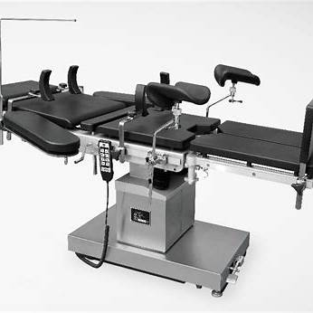
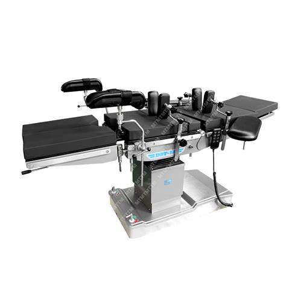
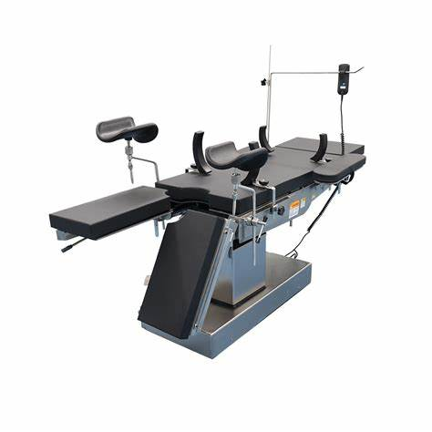
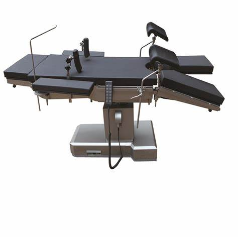

# Operating Room (OR) Table – MDR Example

This document explains how to apply the European Medical Device Regulation (MDR 2017/745) to an **Operating Room (OR) Table**. Designed for biomedical engineers and regulatory professionals.

---

## 📌 1. Device Description

An **OR Table** is a motorized platform used to position and support a patient during surgical procedures. It allows:

- Height adjustment  
- Trendelenburg/reverse tilt  
- Lateral tilt and back/leg section movement  
- Weight distribution and patient fixation

Types:
- Electro-mechanical or hydraulic
- With/without integrated X-ray capability
- With memory foam or anti-static pads

---

##  2. MDR Classification

Under **MDR Annex VIII, Rule 9**:

> **“All active therapeutic devices intended to support the human body for surgical purposes are Class IIa.”**

So:
- **OR Tables = Class IIa**

Because they affect **patient positioning during surgery**, and may indirectly affect **circulation, respiration, or surgical access**.

---

##  3. Technical Documentation (Annex II)

Must include:

- Mechanical and electrical system design
- Maximum load capacity and stability test results
- Control system (footswitch, remote, memory presets)
- Battery backup or emergency manual release
- Patient fixation accessories (straps, pads)
- Risk analysis (ISO 14971)
- Electrical safety (IEC 60601-1)
- EMC compliance (IEC 60601-1-2)
- Cleaning/disinfection compatibility
- Movement limits and safety interlocks

---

##  4. Clinical Evaluation (Annex XIV)

Provide evidence for:

- Stability and load-bearing under various conditions
- Smoothness and accuracy of movements
- Safety of patient positioning (Trendelenburg, tilt, etc.)
- Compatibility with surgical imaging (if applicable)
- Prevention of pressure injuries during long procedures

---

##  5. Labeling & IFU (Annex I)

Include:

- CE mark and UDI
- Weight limit and max patient size
- Instructions for positioning and control use
- List of compatible accessories
- Battery and manual override procedures
- Warnings for risk of patient fall, pinch points, or tipping
- Maintenance and cleaning instructions

---

##  6. CE Marking

- Requires **Notified Body** assessment (Class IIa)
- Conformity via **Annex IX** (QMS audit) or **Annex XI**
- ISO 13485 QMS is mandatory
- Declaration of Conformity referencing MDR

---

##  7. Post-Market Surveillance

You must:

- Monitor mechanical failures, actuator issues, power loss
- Analyze reports of unstable patient positioning
- Collect maintenance and service logs
- Submit PSUR (Periodic Safety Update Report)

---

##  8. Economic Operators

Define roles for:

- Manufacturer
- Authorized Representative (non-EU)
- Importer / Distributor
- Maintenance and support partners

Each must comply with MDR Articles 11–16

---

##  9. Relevant Standards

- **IEC 60601-1** – Electrical safety  
- **IEC 60601-1-2** – EMC  
- **IEC 60601-2-46** – Particular requirements for OR tables  
- **ISO 14971** – Risk management  
- **ISO 10993** – Biocompatibility of patient-contact surfaces  
- **IEC 62366** – Usability engineering  

---
### Operating Room Table – Image 1

---

### Operating Room Table – Image 2

---

### Operating Room Table – Image 3

---

### Operating Room Table – Image 4

##  Summary

| Step                         | Action                                      |
|------------------------------|---------------------------------------------|
| Classification               | Class IIa                                   |
| Technical File               | Design, safety tests, movement control      |
| Clinical Evaluation          | Load stability, positioning accuracy        |
| Label & IFU                  | CE, limits, cleaning, safety instructions   |
| Conformity Assessment        | NB review + Annex IX or XI                  |
| Post-Market Surveillance     | PMS, PSUR, maintenance data                 |
| Economic Operators           | Defined per MDR Articles 11–16              |

---

**Note:** This file is for educational purposes only. MDR submissions require full technical, clinical, and regulatory validation.
