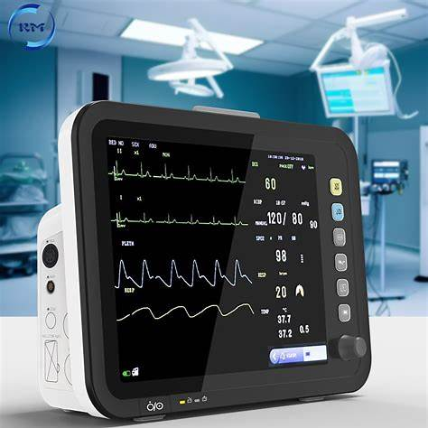
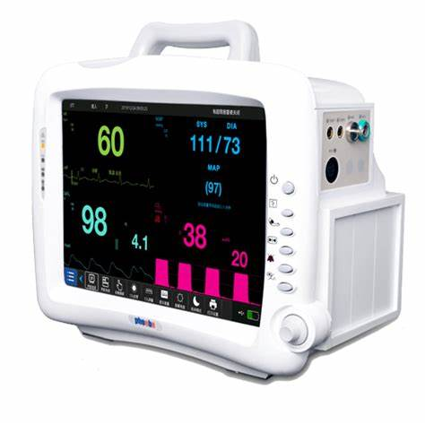
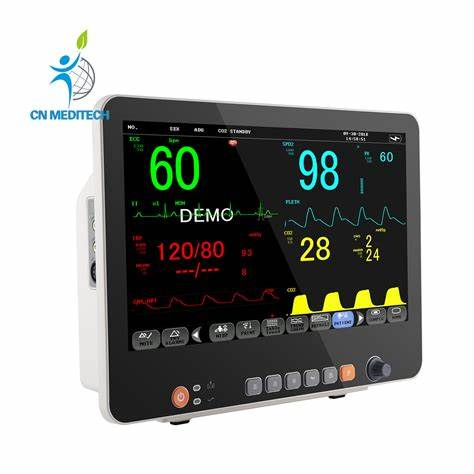
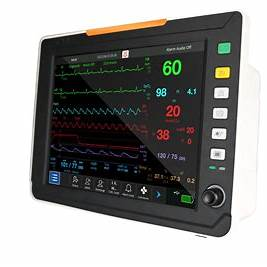

# Patient Monitor – MDR Example

This document explains how to apply the European Medical Device Regulation (MDR 2017/745) to a **patient monitor**. It is intended for biomedical engineers and regulatory beginners.

---

##  1. Device Description

A **patient monitor** is a multi-parameter device that continuously measures and displays a patient's vital signs. It typically includes:

- ECG (electrocardiogram)
- SpO₂ (oxygen saturation)
- NIBP (non-invasive blood pressure)
- Respiration rate
- Temperature
- Optional: EtCO₂, invasive BP, cardiac output

Used in ICUs, ORs, ERs, and step-down units.

---

##  2. MDR Classification

According to **MDR Annex VIII, Rule 10**:

> **“Devices intended to monitor vital physiological parameters where variations could result in immediate danger are Class IIb.”**

Thus:
- **All full-function patient monitors = Class IIb**
- Basic monitors with limited functions may be **Class IIa**, but rarely

---

##  3. Technical Documentation (Annex II)

Must include:

- Block diagram and signal flow between sensors
- Hardware design: display, power, alarms, interfaces
- Description of each parameter and its acquisition method
- Sensor specs (ECG leads, SpO₂ probes, NIBP cuff)
- Alarm logic, thresholds, delay settings, user response
- Risk analysis (ISO 14971)
- Software logic flow (IEC 62304)
- Electrical safety & leakage tests (IEC 60601-1)
- EMC (IEC 60601-1-2)
- Usability and human factors testing (IEC 62366)
- Biocompatibility of patient-contacting parts (ISO 10993)

---

##  4. Clinical Evaluation (Annex XIV)

You must show:

- Accuracy and reliability of each parameter
- Clinical validation for ECG, SpO₂, NIBP, etc.
- Performance under motion artifacts and low perfusion
- Equivalence with existing monitors (predicate devices)
- Alarm effectiveness and response testing

---

##  5. Labeling & IFU (Annex I)

Must include:

- CE marking and UDI
- Parameter range and accuracy for each function
- Instructions for sensor placement and connection
- Alarm meanings, limits, and troubleshooting
- Cleaning and disinfection procedures
- Battery info and backup time
- Warnings related to measurement limitations (e.g. false alarms)

---

##  6. CE Marking

- Requires **Notified Body** assessment
- **Class IIb → Annex IX (Full QMS audit)** or **Annex XI**
- ISO 13485 QMS certification is mandatory
- Declaration of Conformity must reference MDR + all applicable Annexes

---

##  7. Post-Market Surveillance

You must:

- Implement PMS plan covering all parameters
- Collect field performance data and user complaints
- Report software glitches or sensor failures
- Submit PSURs (Periodic Safety Update Reports)
- Track alarm incidents and evaluate effectiveness

---

##  8. Economic Operators

Clearly define:

- Manufacturer
- Authorized Representative (non-EU)
- Importer & Distributor
- Technical service providers

All must fulfill their roles per MDR Articles 11–16.

---

## ⚠ 9. Relevant Standards

- **IEC 60601-1** – General electrical safety  
- **IEC 60601-1-2** – EMC  
- **IEC 60601-1-8** – Alarms  
- **ISO 80601-2-61** – SpO₂ performance  
- **IEC 60601-2-27** – ECG modules  
- **ISO 81060-2** – NIBP  
- **IEC 62304** – Software lifecycle  
- **ISO 14971** – Risk management  
- **IEC 62366** – Usability  
- **ISO 10993** – Biocompatibility

---
### Patient Monitor – Image 1

---

### Patient Monitor – Image 2

---

### Patient Monitor – Image 3

---

### Patient Monitor – Image 4

##  Summary

| Step                         | Action                                      |
|------------------------------|---------------------------------------------|
| Classification               | Class IIb                                   |
| Technical File               | All sensor specs, alarms, software, safety  |
| Clinical Evaluation          | Accuracy of ECG, SpO₂, NIBP, RR, etc.       |
| Label & IFU                  | CE, UDI, parameters, cleaning, warnings     |
| Conformity Assessment        | Notified Body (Annex IX or XI)              |
| Post-Market Surveillance     | PSURs, alarm effectiveness, failures        |
| Economic Operators           | Roles clearly assigned and documented       |

---

**Note:** This is an educational document only. Actual MDR submissions require detailed technical and legal review.
