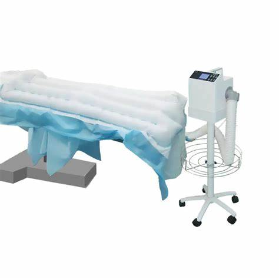
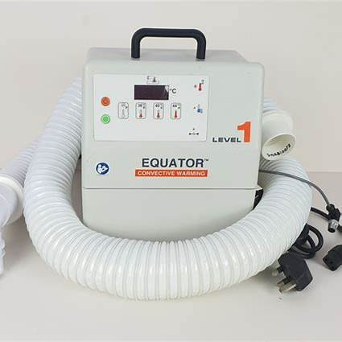
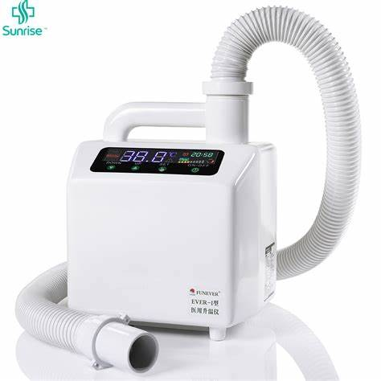
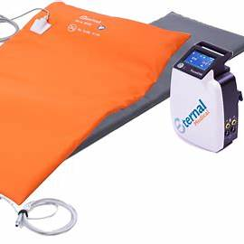

# Patient Warming System – MDR Example

This document explains how to apply the European Medical Device Regulation (MDR 2017/745) to a **Patient Warming System**. It is designed for biomedical engineers and regulatory learners.

---

##  1. Device Description

A **Patient Warming System** maintains or raises the body temperature of a patient during or after surgery.

Types:
- Forced-air warming (e.g. Bair Hugger)
- Conductive blankets
- Water-circulating heating pads
- Infrared radiant warmers (e.g. for neonates)

Applications:
- Prevent hypothermia during surgery  
- Maintain normothermia in ICU or recovery  
- Neonatal care

---

##  2. MDR Classification

Under **MDR Annex VIII, Rule 9**:

> **“All active therapeutic devices intended to administer energy (heat) to the human body are at least Class IIa.”**

So:
- **Patient Warming Devices = Class IIa**

Because they deliver **thermal energy** and impact **vital physiological functions** (e.g. blood flow, metabolism, recovery).

---

##  3. Technical Documentation (Annex II)

Must include:

- System overview (air flow, water circulation, heating element)
- Temperature control mechanism and limits
- Safety features: over-temperature cutoff, alarms
- Materials in contact with skin (biocompatibility)
- Power specs and backup (if applicable)
- Risk management file (ISO 14971)
- Electrical safety (IEC 60601-1)
- Thermal safety and leakage current analysis
- EMC testing (IEC 60601-1-2)

---

##  4. Clinical Evaluation (Annex XIV)

Provide evidence for:

- Effective maintenance of body temperature
- Prevention of perioperative hypothermia
- Safe temperature ranges for prolonged use
- Skin burn risk analysis
- Comparison with similar marketed devices

---

##  5. Labeling & IFU (Annex I)

Must include:

- CE mark and UDI
- Target temperature range and safety limits
- Warnings for overheating or prolonged contact
- Instructions for sensor/blanket/pad placement
- Cleaning and disinfection steps
- Battery operation (if portable)
- Contraindications (e.g. skin damage, neuropathy)

---

##  6. CE Marking

- Requires **Notified Body** assessment (Class IIa)
- Conformity via **Annex IX** or **Annex XI**
- ISO 13485 QMS certification required
- Declaration of Conformity in line with MDR

---

##  7. Post-Market Surveillance

Implement a PMS system:

- Track thermal injury complaints (e.g. burns)
- Monitor control system failures or sensor errors
- Submit **PSUR** regularly
- Review maintenance reports and field issues

---

##  8. Economic Operators

Define:

- Manufacturer
- Authorized Representative (if outside EU)
- Importer and Distributor
- Service & support providers

All must comply with MDR Articles 11–16

---

## ⚠ 9. Relevant Standards

- **IEC 60601-1** – General electrical safety  
- **IEC 60601-1-2** – EMC  
- **IEC 60601-2-35** – Particular standard for warming devices  
- **ISO 14971** – Risk management  
- **IEC 62366** – Usability engineering  
- **ISO 10993** – Biocompatibility (for pads/blankets)

---
### Patient Warming System – Image 1

---

### Patient Warming System – Image 2

---

### Patient Warming System – Image 3

---

### Patient Warming System – Image 4

##  Summary

| Step                         | Action                                      |
|------------------------------|---------------------------------------------|
| Classification               | Class IIa                                   |
| Technical File               | Heating control, limits, materials, safety  |
| Clinical Evaluation          | Warming efficacy, burn risk                 |
| Label & IFU                  | CE, usage instructions, warnings            |
| Conformity Assessment        | Notified Body + Annex IX or XI              |
| Post-Market Surveillance     | PSUR, incidents, overheating complaints     |
| Economic Operators           | Defined and documented per MDR              |

---

**Note:** This document is for educational purposes. Actual MDR compliance requires full technical, clinical, and legal validation.
